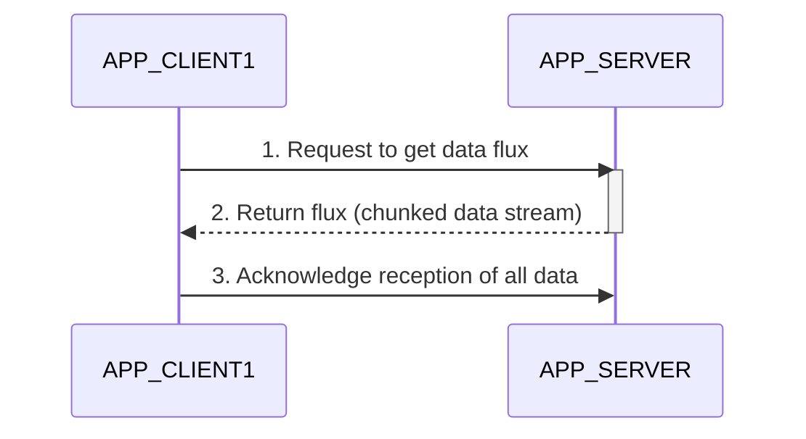
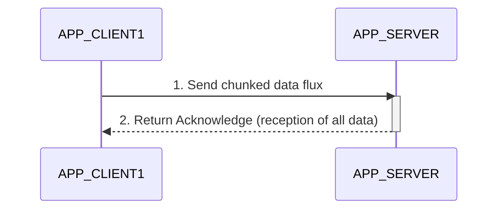
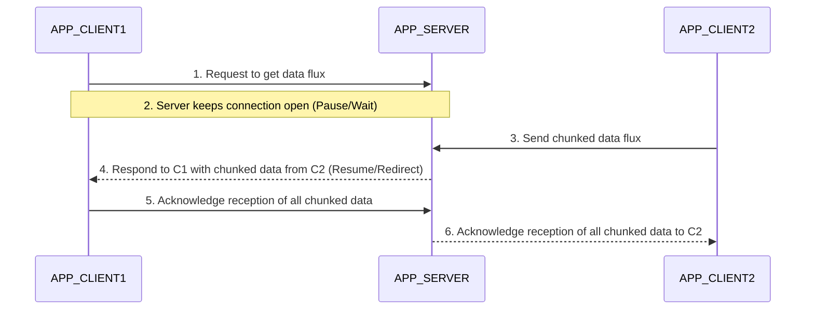

# FLUX Technical Specification

## 1. Executive Summary

FLUX is a Java-based API leveraging Project Reactor Netty for asynchronous, non-blocking real-time data exchange over the HTTP protocol. It is engineered for high performance and high scalability, supporting bidirectional data streams (push/pull), advanced flux management (pause, resume, redirect), and robust connection handling.

## 2. Architecture & Tech Stack

### 2.1. Tech Stack
- **Language**: Java 25
- **Core Framework**: Project Reactor Netty (reactor-netty-http), HttpServer, HttpClient
- **Build Tool**: Maven (packaging as Jar with dependencies)
- **Logging**: SLF4J / Logback
- **Testing**: JUnit 5 (Jupiter), Hamcrest, Reactor Test, Mockito

### 2.2. Package Structure
The core implementation resides in `fr.jdiot.dev.flux` (as per system guidelines).

- `fr.jdiot.dev.flux.client`: HTTP Client implementations for pulling from and pushing to the server.
- `fr.jdiot.dev.flux.server`: HTTP Server handling inbound requests, routing, and connection state.
- `fr.jdiot.dev.flux.core`: Central logic handling flux pooling, back pressure management, and routing data from one flux to another.
- `fr.jdiot.dev.flux.config`: Configuration properties (chunk size, retry policies, timeouts, connection limits).
- `fr.jdiot.dev.flux.security`: TLS setup, SSL contexts, and authentication logic.
- `fr.jdiot.dev.flux.exception`: Domain-specific API exceptions.

## 3. Core Features & Configuration

### 3.1. Supported Configuration Properties
The system supports the following highly tunable properties:
- **Chunk Size**: Determines the payload size for each data chunk.
- **Retry Policy**: Rules for automatic retries upon transient failures.
- **Timeout Policy**: Connection and read/write timeouts.
- **Logging Level**: Adjustable for debugging and monitoring.
- **Max Connections**: Configurable per host, per client, and per server to prevent resource exhaustion.
- **Pool Size for Flux Stream**: Thread pool and resource allocation for flux handling.
- **Back Pressure Size**: Maximum elements buffered before signaling upstream to pause sending.

### 3.2. Security
- Full support for HTTPS (TLS) for encrypted data exchange.
- Extensible authentication mechanism to validate client identities on the server.

### 3.3. Performance & Serialization Constraints
To guarantee high speed and efficient performance during data transfer, the following strict constraints must be applied:
- **Zero-Copy Data Transfer**: Utilize Project Reactor Netty's zero-copy capabilities wherever possible to avoid unnecessary data copying between user and kernel space.
- **Efficient Serialization/Deserialization**: Use high-performance, low-latency serialization libraries that minimize CPU cycles and memory footprint.
- **Memory Management**: Minimize object allocation during the flux stream processing to reduce Garbage Collection (GC) pauses. Use direct `ByteBuf` implementations for native memory allocation.
- **Payload Compression**: Employ lightweight compression algorithms (e.g., LZ4 or Zstd) for large chunked data to optimize bandwidth transfer speed without sacrificing CPU overhead.

## 4. API Usage Scenarios & Sequence Diagrams

### 4.1. Pull Scenario
A client requests data from the server. The server streams the data in chunks, and the client acknowledges upon complete reception.



### 4.2. Push Scenario
A client sends data to the server in a chunked flux. The server acknowledges once all data is fully received.



### 4.3. Pause / Resume / Flux Redirection
A complex scenario where a client initiates a pull request, but the server holds the connection until another client pushes data. The server acts as a relay.



## 5. Message Structures

To ensure reliable communication between clients and the server, structured messages are exchanged.

### 5.1. Acknowledge (ACK) Message
The Acknowledge message is sent by the receiver (client or server) to confirm the successful reception of all data chunks for a specific flux. It is formatted as a JSON payload.

**Example Payload:**
```json
{
  "fluxId": "123e4567-e89b-12d3-a456-426614174000",
  "status": "SUCCESS",
  "receivedChunks": 150,
  "totalBytes": 2048576,
  "timestamp": "2026-06-27T10:30:00Z",
  "message": "All chunked data received successfully."
}
```

**Fields:**
- `fluxId` (String): Unique identifier of the data flux.
- `status` (String): Status of the reception (`SUCCESS`, `PARTIAL`, `FAILED`).
- `receivedChunks` (Integer): Total number of chunks successfully received.
- `totalBytes` (Long): Total payload size received in bytes.
- `timestamp` (String): ISO-8601 timestamp of when the acknowledgement was generated.
- `message` (String): Optional human-readable status message.

### 5.2. HTTP Protocol Specifications

The FLUX API leverages standard HTTP/1.1 (or HTTP/2) semantics for real-time streaming using Project Reactor Netty.

#### 5.2.1. HTTP Methods
- **`GET /api/v1/flux/{fluxId}`**: Used by the client to pull/subscribe to a data flux from the server.
- **`POST /api/v1/flux`**: Used by the client to push a new chunked data flux to the server.
- **`POST /api/v1/flux/{fluxId}/ack`**: Used to explicitly send an Acknowledgement message (though ACK can also be returned as the final HTTP response to a push/pull).

#### 5.2.2. HTTP Status Codes
- **`200 OK`**: Successful completion of a stream or acknowledgement.
- **`202 Accepted`**: Stream request accepted and is being processed asynchronously (often the initial response for a long-lived flux connection).
- **`400 Bad Request`**: Malformed request or missing mandatory headers.
- **`401 Unauthorized` / `403 Forbidden`**: Invalid or missing authentication credentials.
- **`404 Not Found`**: The requested `fluxId` does not exist or has expired.
- **`429 Too Many Requests`**: Backpressure mechanism triggered. The client has exceeded configuration limits and must throttle/back-off.
- **`500 Internal Server Error`**: Unexpected server-side failure during flux processing.

#### 5.2.3. HTTP Headers
Standard and custom HTTP headers ensure proper routing, security, and streaming behavior.

**Standard Headers:**
- `Transfer-Encoding: chunked`: **Mandatory** for push and pull. Allows data to be streamed in chunks without defining a `Content-Length`.
- `Content-Type`: `application/octet-stream` for raw chunked data, or `application/json` for Acknowledgement payloads.
- `Authorization`: Used for passing secure tokens (e.g., `Bearer <token>`).

**Custom Headers:**
- `X-Flux-Id`: Unique identifier for the data stream.
- `X-Client-Id`: Identifier for the client application (`APP_CLIENT1`, `APP_CLIENT2`).
- `X-Chunk-Size`: Negotiated or defined chunk size for the stream.

## 6. Development & Testing Guidelines
- **Test-Driven / High Coverage**: Every class created in `src/main/java/fr/jdiot/dev/flux/` must have a corresponding test class in `src/test/java/fr/jdiot/dev/flux/` with a `Test` suffix.
- **Dependency Management**: Ensure no outside dependencies are introduced without architect approval. Use `reactor-test` extensively for validating non-blocking streams and backpressure behaviors.
- **Code Quality**: Ensure zero unhandled promises/subscriptions, proper resource cleanup, and paranoid security practices.
- **Flux Transfer Benchmarking**: Automated benchmark tests (using tools like JMH or custom load simulators) must be included to measure data transfer speed, serialization overhead, and latency under high concurrency. Code cannot be considered production-ready without passing quality and performance thresholds in these benchmarks.
