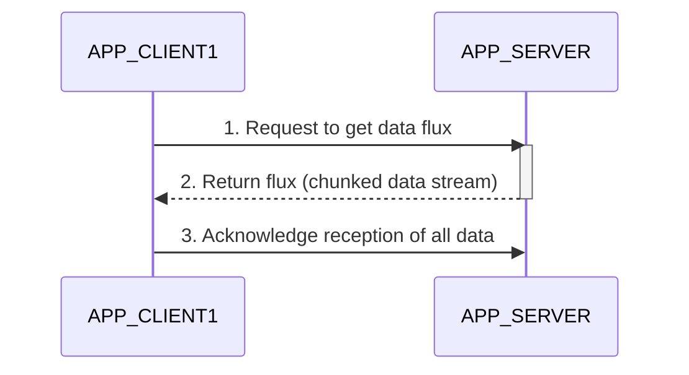
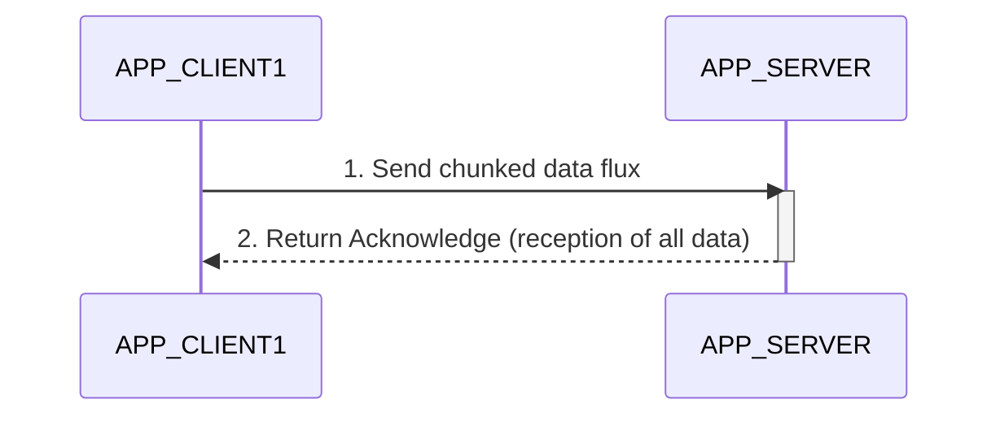
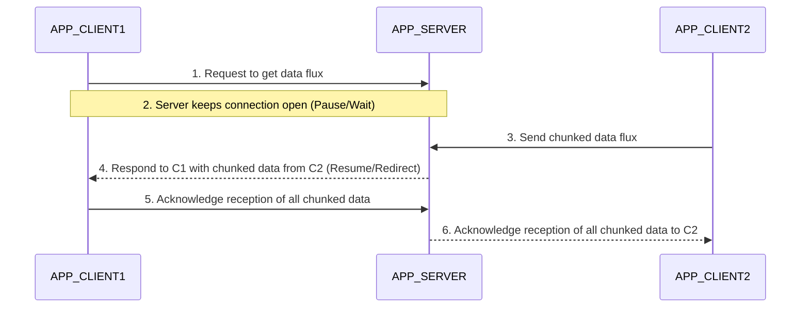

# FLUX Technical Specification

## 1. Executive Summary

FLUX is a Java-based API leveraging Project Reactor Netty for asynchronous, non-blocking real-time data exchange over the HTTP protocol. It is engineered for high performance and high scalability, supporting bidirectional data streams (push/pull), advanced flux management (pause, resume, redirect), and robust connection handling.

## 2. Architecture & Tech Stack

### 2.1. Tech Stack
- **Language**: Java 25
- **Core Framework**: Project Reactor Netty (reactor-netty-http), HttpServer, HttpClient
- **Build Tool**: Maven (packaging as Jar with dependencies)
- **Logging**: SLF4J / Logback
- **Testing**: JUnit 5 (Jupiter), Hamcrest, Reactor Test, Mockito

### 2.2. Package Structure
The core implementation resides in `fr.jdiot.dev.flux` (as per system guidelines).

- `fr.jdiot.dev.flux.client`: HTTP Client implementations for pulling from and pushing to the server.
- `fr.jdiot.dev.flux.server`: HTTP Server handling inbound requests, routing, and connection state.
- `fr.jdiot.dev.flux.core`: Central logic handling flux pooling, back pressure management, and routing data from one flux to another.
- `fr.jdiot.dev.flux.config`: Configuration properties (chunk size, retry policies, timeouts, connection limits).
- `fr.jdiot.dev.flux.security`: TLS setup, SSL contexts, and authentication logic.
- `fr.jdiot.dev.flux.exception`: Domain-specific API exceptions.

## 3. Core Features & Configuration

### 3.1. Supported Configuration Properties
The system supports the following highly tunable properties:
- **Chunk Size**: Determines the payload size for each data chunk.
- **Retry Policy**: Rules for automatic retries upon transient failures.
- **Timeout Policy**: Connection and read/write timeouts.
- **Logging Level**: Adjustable for debugging and monitoring.
- **Max Connections**: Configurable per host, per client, and per server to prevent resource exhaustion.
- **Pool Size for Flux Stream**: Thread pool and resource allocation for flux handling.
- **Back Pressure Size**: Maximum elements buffered before signaling upstream to pause sending.

### 3.2. Security
- Full support for HTTPS (TLS) for encrypted data exchange.
- Extensible authentication mechanism to validate client identities on the server.

## 4. API Usage Scenarios & Sequence Diagrams

### 4.1. Pull Scenario
A client requests data from the server. The server streams the data in chunks, and the client acknowledges upon complete reception.

### 4.2. Push Scenario
A client sends data to the server in a chunked flux. The server acknowledges once all data is fully received.

### 4.3. Pause / Resume / Flux Redirection
A complex scenario where a client initiates a pull request, but the server holds the connection until another client pushes data. The server acts as a relay.

## 5. Development & Testing Guidelines
- **Test-Driven / High Coverage**: Every class created in `src/main/java/fr/jdiot/dev/flux/` must have a corresponding test class in `src/test/java/fr/jdiot/dev/flux/` with a `Test` suffix.
- **Dependency Management**: Ensure no outside dependencies are introduced without architect approval. Use `reactor-test` extensively for validating non-blocking streams and backpressure behaviors.
- **Code Quality**: Ensure zero unhandled promises/subscriptions, proper resource cleanup, and paranoid security practices.

